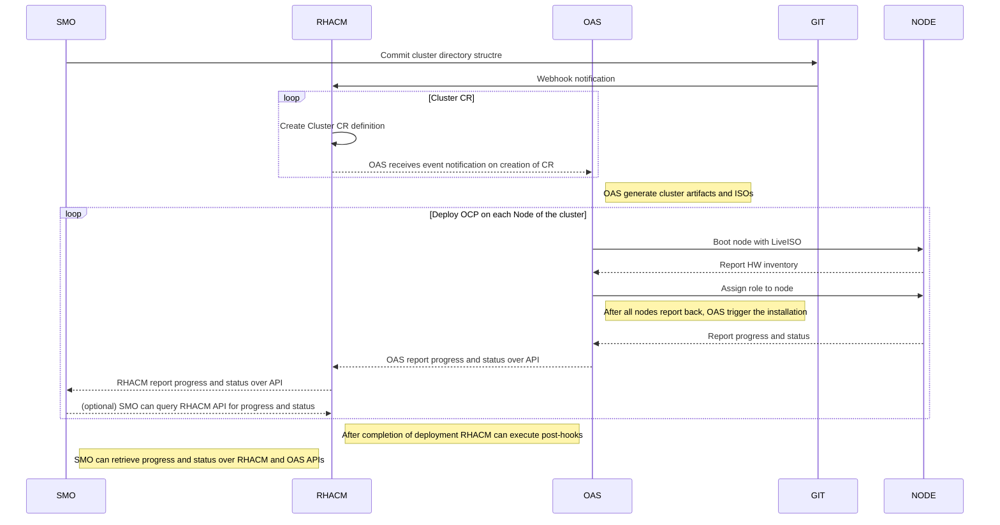

# Provisioning Flow with Orchestrator

- Service Management Orchestration (SMO)
- Red Hat Advanced Cluster Management for Kubernetes (RHACM)
- OpenShift Assisted Service (OAS) Operator or Assisted Installer (AI)

